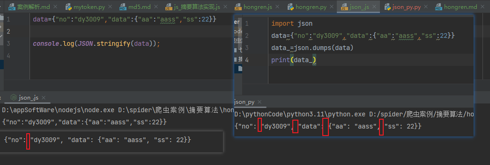
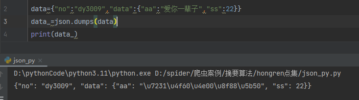

### hongren 注意点 

和mytoken的MD5加密类似，找到加密位置，测试发现，为标准SHA256加密，使用标准库即可

### 有个坑：
在python传递数据给js使用json.dumps;以及在js里使用参数的时候，JSON.Stringfy方法
在给param数据加密的时候，要注意序列化之后的差异

json.dumps和JSON.Stringfy之后的数据如下：
```
param="{\"no\":\"dy3009\",\"data\":{}}"
```
这时候需不需要序列化，需要查看官网原数据如何？

官网加密没有反斜杠，即无论是在js里还是在python里无需序列化，所以这里在扣下js代码时候，要去掉JSON.Stringfy

因为这时候使用的param是从python传递过来，就已经是解析好的参数

**注意细节！！！！尤其是方法都扣下来且认为没有问题时，但是结果出不来，要留意。**


### JSON.Stringfy 和 json.dumps 区别 深坑必看！！！

区别1：
python执行json.dumps 是以" : + 空格 " 作为分割； 而JS里没有空格

区别2：
JS在Stringfy中文时，中文还是中文；但是在PY里会把中文转成unicode编码
data={"no":"dy3009","data":{"aa":"爱你一辈子","ss":22}}

#### 造成的后果
所有传递的数据要么都使用js转，要么都使用py转



