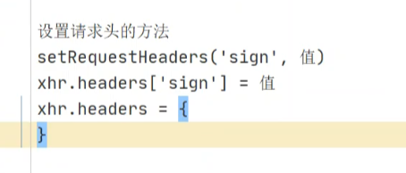
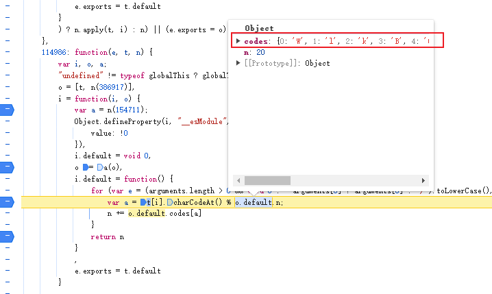

## 企查查逆向（有点东西）

### 请求头参数时时变化，如何定位？

1.设置请求头的位置，下图的三种方式，这属于关键词的一种方式



2.使用XHR方式

注意：
`在使用关键词定位加密位置时，若有多个文件，则需要看哪些js文件是堆栈里执行的文件，
只需要看堆栈里有的js文件即可，其他都可以过滤`

在mytoken里，聊到遇到摘要算法（16进制，只有a-f和数字）时，有写道如何判断MD5加密。

### 那在HMAC里，如何判断使用了什么加密算法？

1.看长度

2.找到加密内容，使用猜测的算法进行加密。看是否一致。若一致则猜测正确

MD5长度为：32

SHA1长度为：40   

SHA224长度为：56 

SHA256长度为：64 

SHA512长度为：128

HmacMD5长度为：32

### 企查查补环境 


注意补环境的时候，不一定都是函数需要补，也可能是固定参数可以直接拿来使用的

扣js代码的时候，要有一定自信，跟着函数走，问题就不大。企查查里有许多名称相似的函数和固定参数

比如i.default,a.default 等等，不要被唬住，换个方法名慢慢扣即可

补环境的一些心得，
1. 遇到摘要算法，可以看看是不是用标准库替代
2. 一步一步的先把调用的环境按顺序补上，不要被重名的方法混淆
3. 遇到扣不下的方法，可以考虑是不是固定值或可以使用其他方法替代


### js知识点补充

我在浏览器里补环境，点击a.default（e,n）跳转到下面的方法
```
a_default = function () {
    var e = arguments.length > 1 && void 0 !== arguments[1] ? arguments[1] : {}
        , t = (arguments.length > 0 && void 0 !== arguments[0] ? arguments[0] : "/").toLowerCase()
        , n = JSON.stringify(e).toLowerCase();
    return bb2(t + n, aa2(t)).toLowerCase().substr(8, 20)
} 
```
有几个问题：
1. 为什么点击跳转的方法有参数，但是跳转的方法a_default没有参数？
2. arguments 是什么，为什么没有申明却可以直接使用？
```angular2html
arguments 对象是一个所有非箭头函数中可用的局部变量，它类似于数组，但不是数组。

它包含了调用函数时传入的所有参数。

函数 a_default 没有显式定义参数，而是通过 arguments 对象来处理传入的参数。
```

测试案例 
```
plus=function(){
    console.log("第一个参数:",arguments[0])
    console.log("第二个参数:",arguments[1])
    return arguments[0]+arguments[1]
}

console.log(plus('1', '2'));

//输出
// 第一个参数: 1
// 第二个参数: 2
// 12  
```