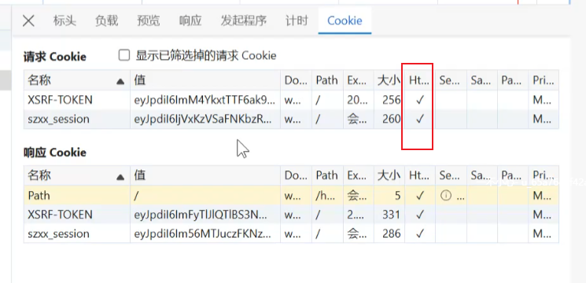
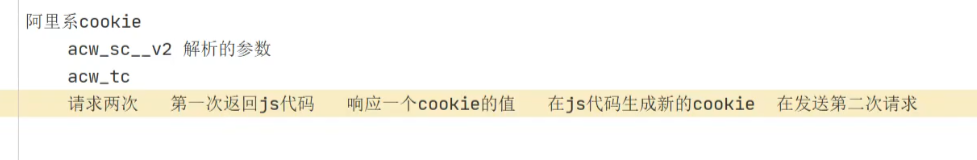
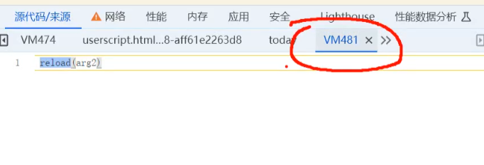
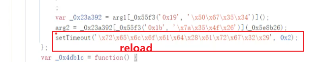
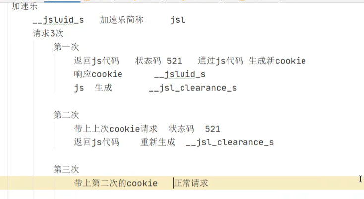
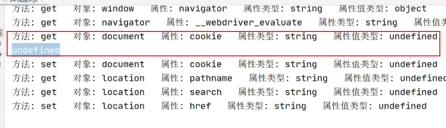
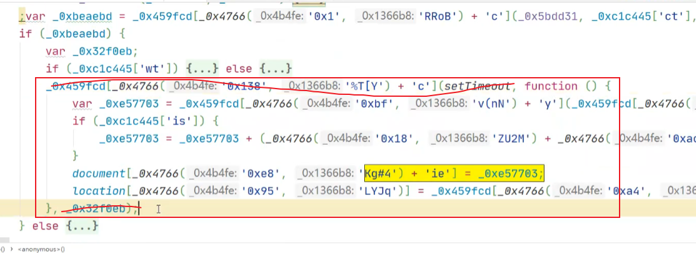
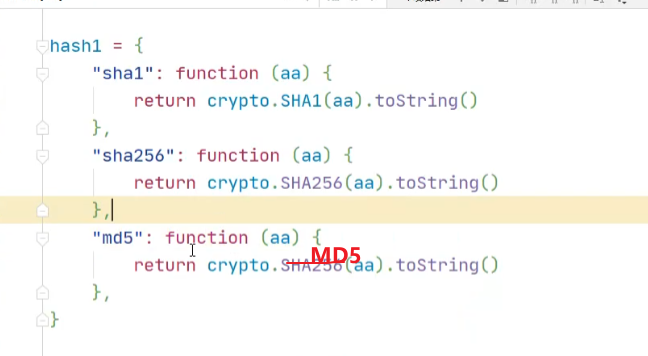

## cookie反爬

### 如何区分cookie是前端生成的，还是服务器返回的？

**httponly字段，打勾，表示服务器返回的数据**

注意无论是hook请求的数据，只能hook到前端生成的数据，对应的即是httponly不打勾。

服务器返回的数据是无法hook到的

### 阿里系的cookie
如何识别？

1.acw_sc_v2 和 acw_tc

2.清除cookie，刷新会自动开启无限debugger
解决无限debugger
```angular2html
Function.prototype.__constructor_back = Function.prototype.constructor;
Function.prototype.constructor = function() {
    if(arguments && typeof arguments[0]==='string'){
        if("debugger" === arguments[0]){
            return
        }
    }
   return Function.prototype.__constructor_back.apply(this,arguments);
}
```

3.cookie反爬第一种，直接返回token数据，可能token写死在网页上，通过获取网页源码即可提取。

cookie反爬第二种，第一次请求返回的是js代码（阿里系），js代码里生成对应cookie的值

4.遇到vm文件（虚拟文件），是什么情况？
**可能是eval或setTimeout里的代码**



5.遇到混淆生成的代码，**第一步，需要找到生成加密参数的位置**，然后再倒推一步步补充替换方法。

6.ob混淆有哪几部分，五大最基本部分：解密函数，大数组，对大数组偏移的设置，重要代码，自执行函数会把数组替换

#### 代码卡住短暂时间，有可能是什么情况？ 
ob混淆会检测代码是否压缩。需要把代码压缩

爬虫最关键的就是找到他加密的位置在哪，其次就是细节的小问题

### jsl产品
jsl特点：__jsluid_s 有jsl简称



出现这个问题，是代码都打印完了，但是log输出还没有执行，这个可能就是settimeout的问题

解决方案：把定时器删除，把方法改成自执行方法



jsl里的加密算法会进行变化，有sha1，sha256，有MD5，所以要把加密位置写活


