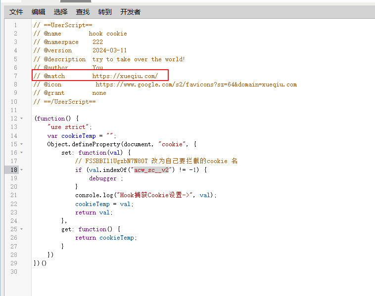
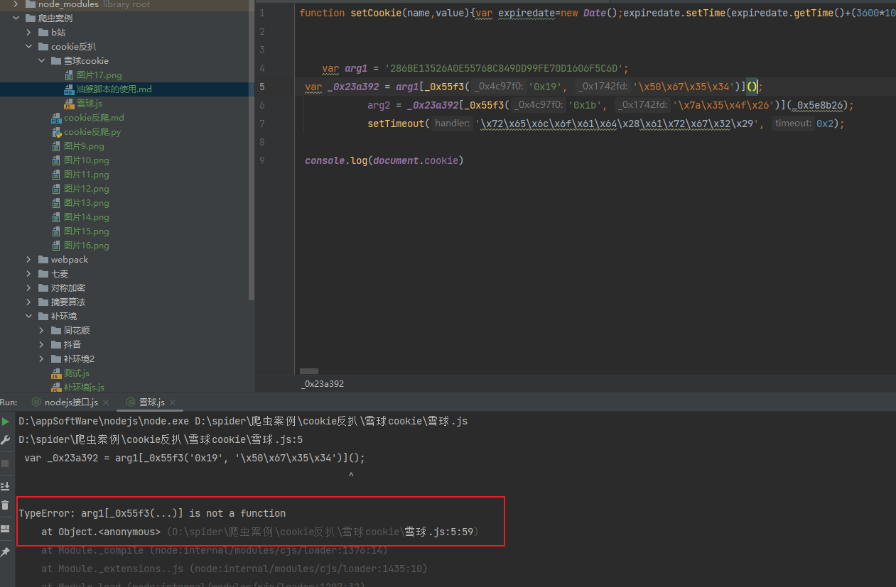
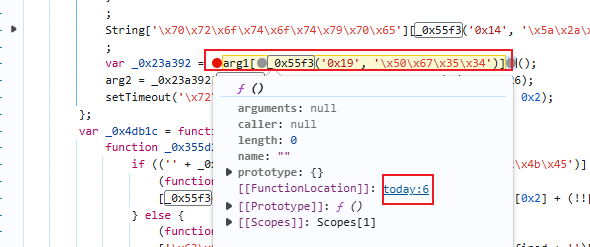

### 油猴的使用
把match对应的网址给换了，即可

注意无论是hook请求的数据，只能hook到前端生成的数据，对应的即是httponly不打勾。

如果hook 不到要考虑两点：

第一点：代码对不对？indexof后面的参数是不是要hook的参数（只能hook前端生成的参数）

第二点：油猴match网址与要hook的网址是否匹配

### 雪球cookie逆向问题

1. is not a function的问题解决：

找到对应的方法，而不是仅仅是看到arg1。

2. 注意带有cookie的数据，不是它参数完整返回的数据，而是其中的一部分
