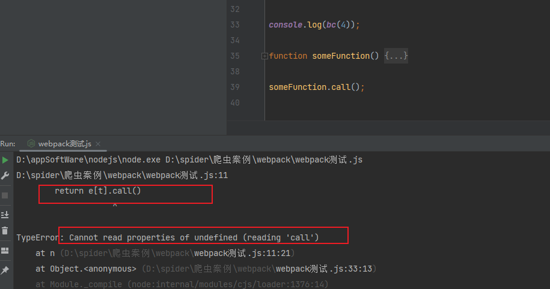

### webpack介绍
简易流程

整套流程是把列表当作实参传递给了自执行参数的e，然后n调用的就是列表的索引值，也就执行到e[t].call,对列表里某个函数进行调用
```angular2html
//外部导出
var bc;

webpack打包格式
!function(e){
    //加载器
    function n(t){
        //可以查看报错缺少什么方法
        console.log(t)
        //这里的call起到了调用函数的作用，即得到函数的返回值
        return e[t].call()
    }

    //调用
    // n(0);
    bc=n

}(
    //插件 模块
    [
        function (){
            console.log("登录")
        },
        function (){
            console.log("加密")
        },
        function (){
            console.log("解密")
        },
    ]

//{
//     aa:function (){
//          console.log("登录")
//      },
//      bb:function (){
//          console.log("加密")
//      },
//      cc:function (){
//          console.log("解密")
//      },
//}
)

console.log(bc(0));

function someFunction() {
  console.log("lallalalal");
}

someFunction.call();

```

### webpack常见报错 

遇到call方法的报错，就是调用的下标在`模块`里没有对应的函数，方法不存在


### call方法介绍

```angular2html
语法： func.call(thisArg, arg1, arg2, ...);

参数：
thisArg：在函数执行时作为其 this 值的对象。
arg1, arg2, ...：函数调用时传入的参数。

用法：
改变 this 值：当你想要调用一个对象的方法，但是想要指定不同的 this 上下文时，
可以使用 call 方法。

调用函数：call 可以被用来调用任何函数，不仅仅是对象的方法。
```


