### 抖音逆向

## 定位加密位置 （困难）
遇到apply匿名函数，需要点击 执行下一步函数调用，进入详细函数，进行调试
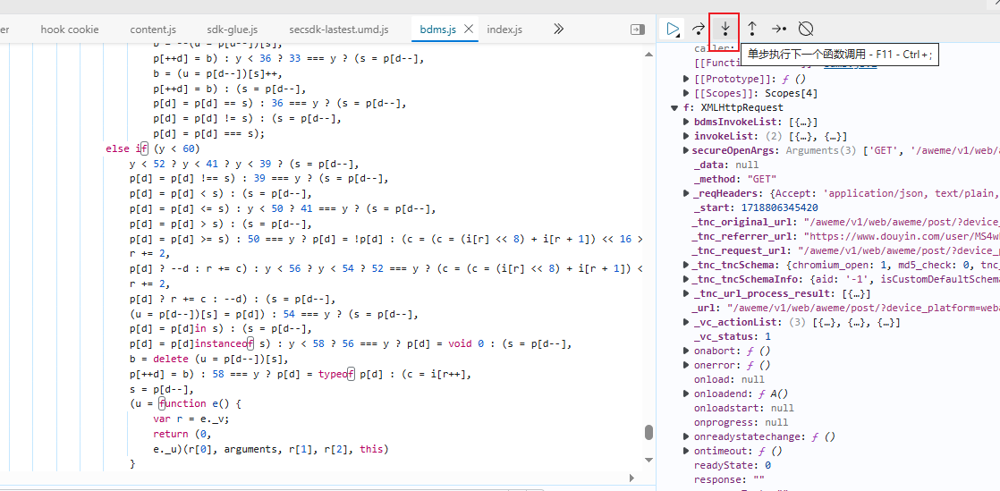


## 抖音定位加密问题梳理
抖音的挺多的，有许多参数很类似，一不留神就看错了。`留神`要找到真正的参数

第一步，xhr定位
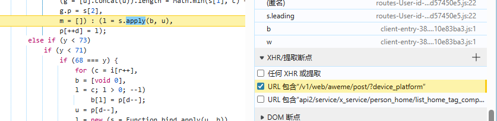

第二步，逐步跟栈调试，目标找到准确加密位置。要学会看参数，比如说这里的p和l
会发现这里的逻辑是，把l逐渐赋值给p上
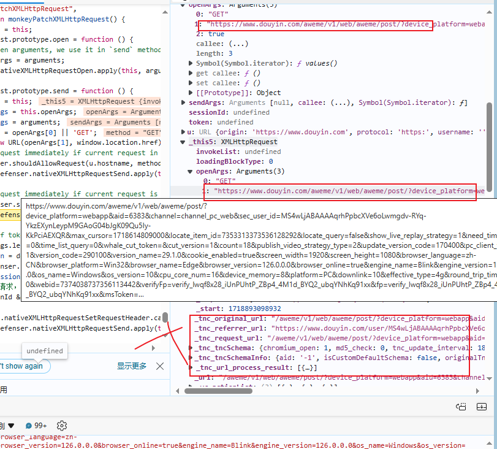
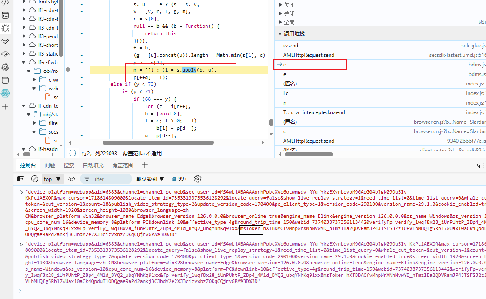
跟到第二步的时候就发现，这里参数p只有mstoken没有a_bogus,所以这里就是有可能存生成a_bons的代码

p一定是根据这里的l赋值得到的，但是这里是个循环，不确定是哪个l赋值过来的，可以在p的地方下一个日志断点，输出结果

注意：这里日志断点不要打到l=s.apply上，因为这l还是在动态变化的，日志输出断点要打到赋值的位置（赋值位置才是请求发送的位置），即p或第二行的l
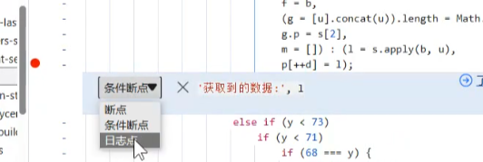

然后接下来考虑，在什么情况下，断点要赞停，即可以考虑生成p>100时，让程序暂停
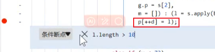

断点暂停后，进s.apply函数内部，要返回的就是下图的return，然后把这里的u给取出来，
注意这里的u就是e。return返回的数据，就是加上a_bogus的数据

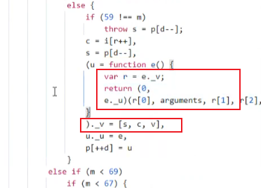

学会使用输出断点，查看加密参数是不是猜测的输出（尤其是在面对过多的循环）

jsvmp特征：有许多的数字，下面有0，1，2，3，4的大括号，这就是jsvmp的特征。
遇到就可以把整个js文件扣下来，开始补环境
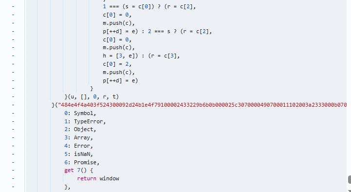


补环境：
'window', 'document', 'location', 'navigator'常见的函数，方法，应补尽可能补
1.遇到标签报错 
```angular2html
 createElement: function (res) {
        console.log("createElement返回数据为", res)
        if (res == "span") {
            return {}
        }
    }
```

2.遇到XMLHttpRequest 报错

在jsdom里可以直接补
window = dom.window ; XMLHttpRequest=window.XMLHttpRequest

但是在常规的补环境中，需要补一个空方法
```angular2html
XMLHttpRequest=function(res){
    console.log("XMLHttpRequest返回数据为", res)
}
```

3.注意 找到调用方法时，请注意是不是同一处（可能存在多种相同方法，注意方法位置）
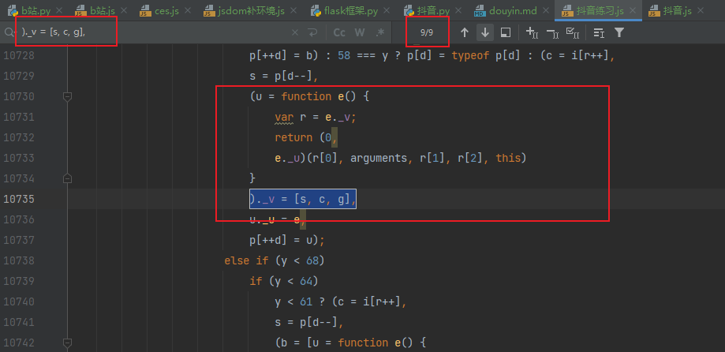

4.如何得到return参数数值，进行补参数？

这里调用了三次e，在第二次e的下面调用一次即可
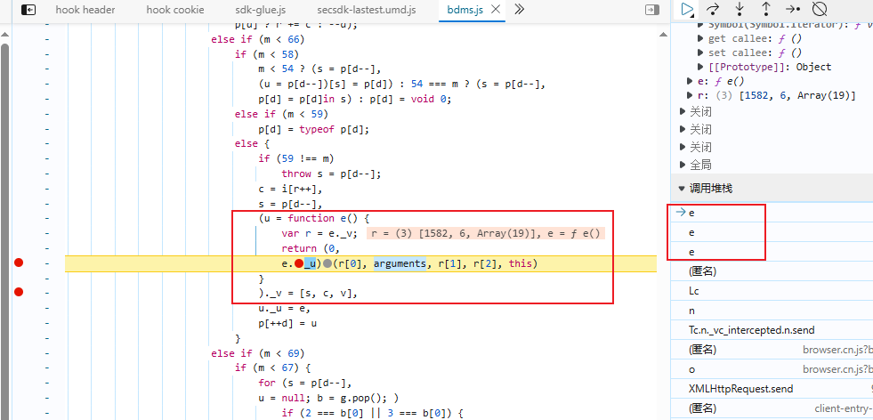

5. 在补参数的时候，要注意参数的值是字典还是数组,要是用字典替代的数组,要家length字段不然会有问题.

length+字典 == 数组

6.用python调用js的时候会出现返回响应200，但是就是返回没有数据的情况
这时候请注意，请求头里的reffer（抖音有校验）

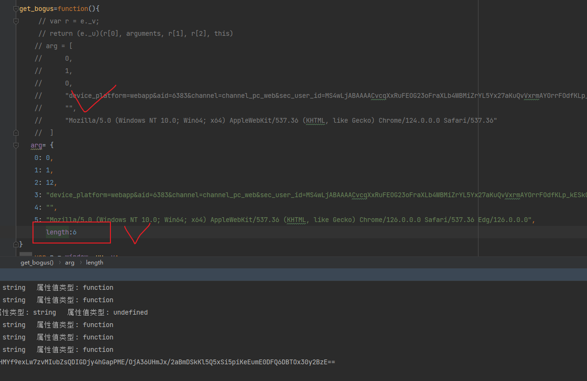

7.未知因素，python调用js方法下，最好不要调用函数，会出错
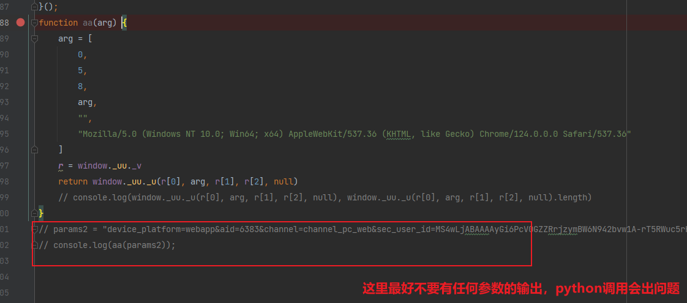


抖音找参数踩坑指南：
抖音参数有很多都很类似而且有很多都带有a_bogus，第一次上手，找个参数能找的怀疑人生

有带get请求的优先看，完整链接优先看，参数较全的优先看；只有字符串拼接参数的，要仔细看，不一定是要找的参数