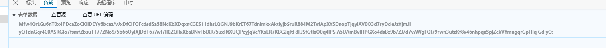
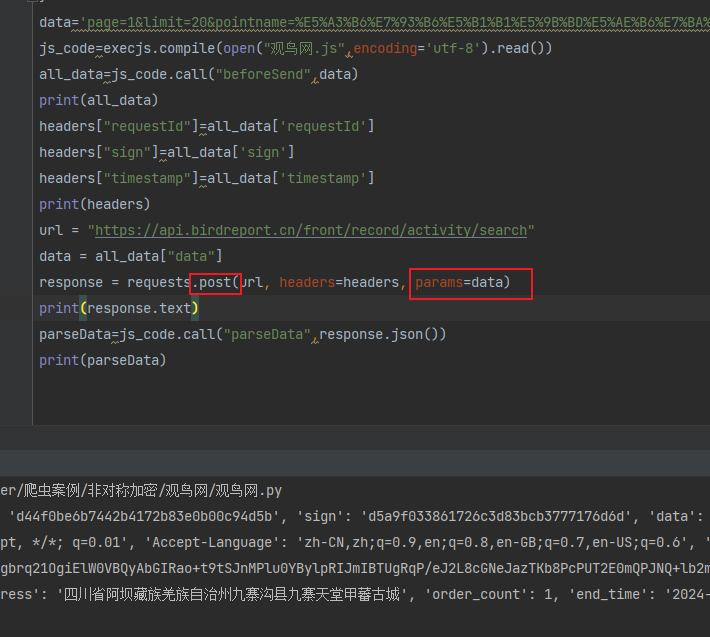
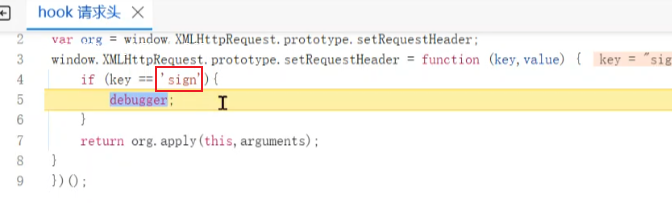
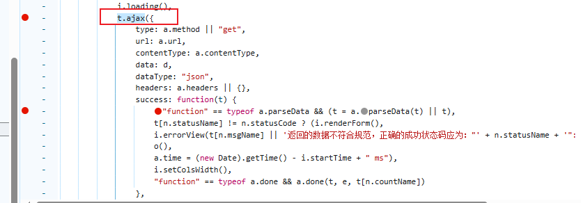
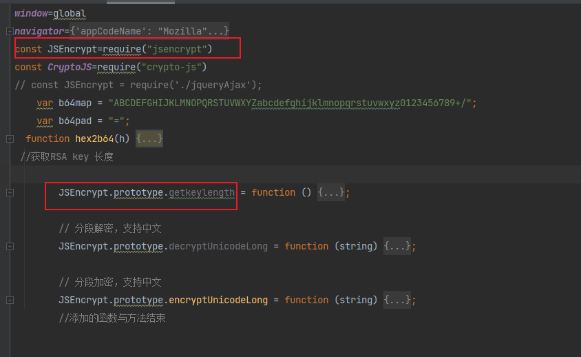

### 观鸟网逆向分析 

请求头，加密参数；载荷，连同关键词一起加密；返回数据，data和sign加密

载荷数据，直接传字符串，可以在python里用params传

`注意：如果在post请求里，返回值一直得不到，可以考虑把data改成params参数，这样可能可以获取到返回值的数据`

### 定位

先通过sign关键词搜索，发现没有找到什么数据；再使用hook 请求头的sign值（注意大小写）

如果hook不到，可能是`首字母大小写`问题；如果还找不到，则可能是设置请求头参数方法不同，则需要换方法

### 找到加密位置
找到发送ajax请求，加密位置可能就在发送ajax方法里

如何判断是否扣代码还是可以使用标准库？

在网页上测试，利用md5摘要算法的特性（加密同样的内容加密数据不变）进行验证网站是否使用标准md5

### 怎么定位返回数据加密

1.decrypt 或返回参数关键词定位

2.找到发送请求的回调函数，success或者第.then或这ajax的第二个参数

### 在标准库的类有新增的方法，怎么扣？

在JavaScript中，JSEncrypt.prototype.getkeylength = function () {} 这行代码表示为 
JSEncrypt 类的原型（prototype）添加了一个名为 getkeylength 的新方法。
原型是JavaScript对象的共享属性和方法的来源。当你为一个构造函数的原型添加方法时，所有该构造函数创建的实例都将能够访问这个方法。

`简单点讲，就是在JSEncrypt类里新增了一个getkeylength方法,然后可以使用JSEncrypt进行调用`

### 总结 
观鸟网整体还是有些难度。用RSA算法加密返回的请求头和载荷数据，然后AES算法解密了返回的数据。

涉及到知识点全面，有定位（简单关键词定位不到，用hook），扣代码在标准库上新增函数细节要注意，然后返回值解密
如何定位。是个不错的练习网站

