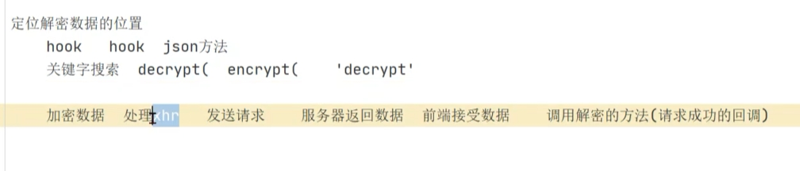
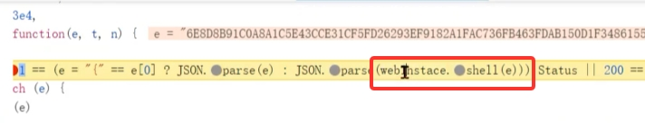
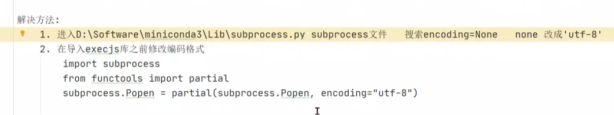
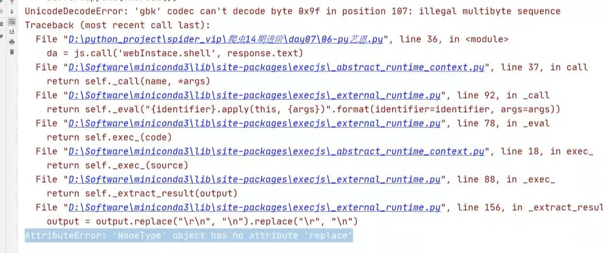
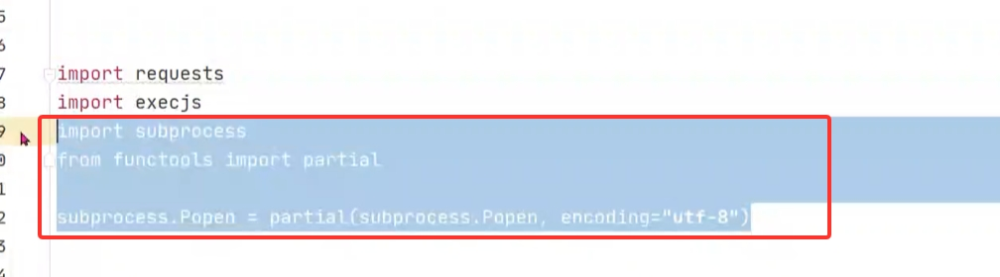

## 艺恩数据逆向 


### 如何处理返回数据加密？

1. hook JSON.parse

要想把加密数据变成明文（看得懂的数据）必须要用 JSON.parse 进行解密
```angular2html
var my_parse = JSON.parse;
JSON.parse = function (params) {
    //这里可以添加其他逻辑比如 debugger
    debugger
    console.log("json_parse params:",params);
    return my_parse(params);
};
```

2. 如果返回的数据超级长，首先不可能是摘要算法（1摘要算法不可逆 2最长的SHA512才128位），很大概率是**对称加密或非对称加密** 
所以也可以使用关键词 `decrypt` 进行定位。
```angular2html
举例：
decrypt(
若进行了混淆
'decrypt'
```



## 扣代码方式：全扣

半扣使用场景：单独的，简单的函数

全扣使用场景: this比较多；代码是类的形式；逻辑较为复杂，可以考虑把整个类都拿下来。

若某个方法代码逻辑相对复杂有混淆。并且是调用的某个方法（主要调用方法，）,则可以考虑把所有相关代码抠出来，再调用。（有点像webpack）




## execjs编码报错 

看到unicodeDecodeError ，要想要文件编码的问题





不想改源码，可以加上三行代码

```
import subprocess
from functools import partial
subprocess.Popen=partial(subprocess.Popen,encoding='utf-8')
```




